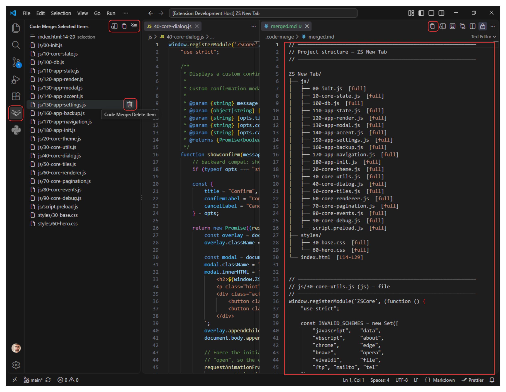
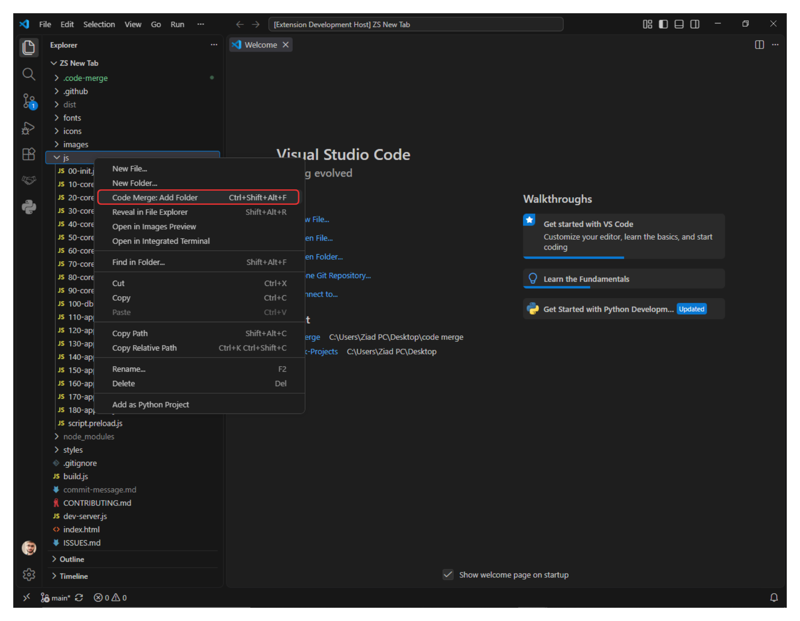
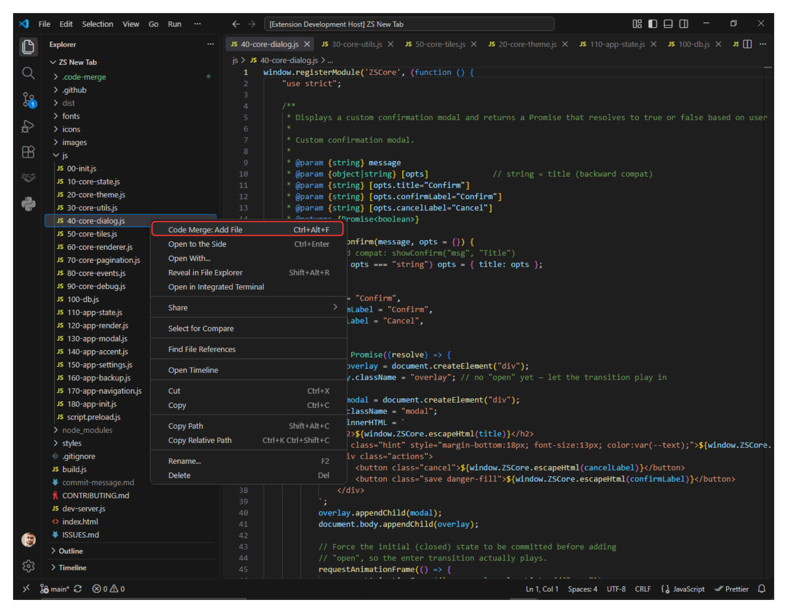
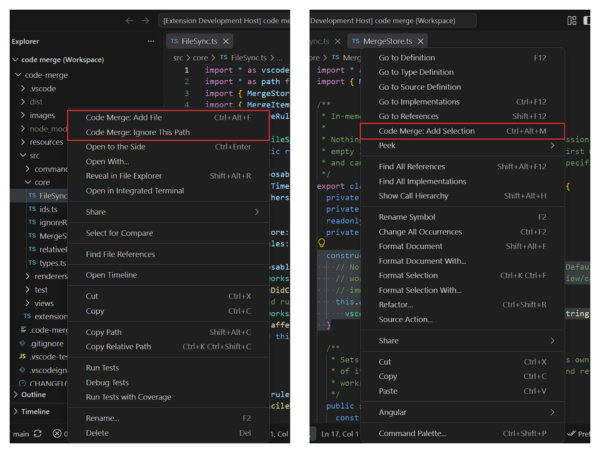

# Code Merge

> Select files, folders, or code snippets and merge them into a single
> markdown file — with a project tree and per-file headers. Perfect for
> feeding context to LLMs (ChatGPT, Claude, Copilot) or sharing code
> snapshots with your team.

<p>
  
  
</p>
<p>
  
  
</p>

---

## ✨ Features

- **📁 Add files** — right-click any file in the Explorer, or use the keyboard.
- **📂 Add folders** — recursively scan a folder with smart ignore rules
  (`node_modules`, `.git`, `dist`, `.venv`, binaries, lockfiles, …).
- **✂️ Add selections** — grab a range of lines from the current editor
  (supports multi-cursor with `Ctrl+D`).
- **🌲 Project tree** — every merged output starts with an ASCII tree of
  the selected items, including line ranges for selections.
- **📝 Auto-generated `merged.md`** — written to `.code-merge/merged.md`
  inside your workspace on every change.
- **📋 One-click copy** — copy the entire merged content to the clipboard.
- **🔒 Workspace isolation** — each workspace folder gets its own
  `.code-merge/merged.md` and its own item list. Switching between
  multi-root workspaces is seamless.
- **⚡ Debounced writes** — batches rapid changes so disk I/O stays low.
- **💾 Persistent state** — selections survive VS Code restarts.

---

## 🚀 Usage

### Adding items

| Action | How |
|---|---|
| Add a file | Right-click file in Explorer → **Code Merge: Add File** |
| Add a folder | Right-click folder in Explorer → **Code Merge: Add Folder** |
| Add a selection | Select code → right-click → **Code Merge: Add Selection** |

### Viewing & exporting

Open the **Code Merge** view from the Activity Bar to see all selected
items. From there you can:

- **Preview** (`$(open-preview)`) — opens `.code-merge/merged.md` beside
  the current editor.
- **Copy** (`$(copy)`) — copies the full merged output to the clipboard.
- **Clear** (`$(clear-all)`) — removes every item for the current
  workspace.

Clicking any item in the tree opens its source file.

### Example output

````markdown
// ────────────────────────────────────────────────────────────
// Project structure — my-api
// ────────────────────────────────────────────────────────────

my-api/
├── src/
│   ├── index.ts  [full]
│   ├── routes/
│   │   └── auth.ts  [L10-L25, L40-L50]
│   └── db.ts  [full]
└── README.md  [full]

// ────────────────────────────────────────────────────────────
// src/index.ts (typescript) — file
// ────────────────────────────────────────────────────────────
import express from 'express';
...

// ────────────────────────────────────────────────────────────
// src/routes/auth.ts [L10-L25] (typescript) — selection
// ────────────────────────────────────────────────────────────
export function login(req, res) {
  ...
}
````

---

## ⌨️ Keyboard shortcuts

| Command | Windows / Linux | macOS |
|---|---|---|
| Add Selection | `Ctrl+Alt+M` | `Cmd+Alt+M` |
| Add File | `Ctrl+Alt+F` | `Cmd+Alt+F` |
| Add Folder | `Ctrl+Alt+Shift+F` | `Cmd+Alt+Shift+F` |
| Open Preview | `Ctrl+Alt+P` | `Cmd+Alt+P` |
| Copy Merged Content | `Ctrl+Alt+C` | `Cmd+Alt+C` |

All shortcuts can be rebound from **Keyboard Shortcuts** (`Ctrl+K Ctrl+S`).

---

## ⚙️ Configuration

No settings yet. Ignore rules are built-in and cover:

- **Directories** — `node_modules`, `.git`, `dist`, `build`, `out`,
  `coverage`, `target`, `.venv`, `__pycache__`, `.next`, `.cache`, …  
  (`.github`, `.gitlab`, and `.devcontainer` are *not* ignored so CI
  configs can be merged.)
- **Extensions** — images, audio/video, archives, binaries, fonts,
  documents, databases, logs.
- **Filenames** — `package-lock.json`, `yarn.lock`, `pnpm-lock.yaml`,
  `Cargo.lock`, `.env`, `.env.*`, etc.
- **Size** — files larger than **5 MB** are skipped automatically.

---

## 📋 Requirements

- VS Code **1.85.0** or newer.
- No external dependencies.

---

## 🐛 Known issues

- `.gitignore` files inside the workspace are **not** respected yet —
  only the built-in ignore rules apply.
- Very large folders (10,000+ files) may take a few seconds to scan.
- Binary detection is heuristic (`\0` byte check) — rare false positives
  are possible for UTF-16 files.

---

## 🤝 Contributing

Issues and PRs welcome at
[github.com/ziadshalaby00/code-merge](https://github.com/ziadshalaby00/code-merge).

To develop locally:

```bash
git clone https://github.com/ziadshalaby00/code-merge.git
cd code-merge
npm install
npm run watch
```

Then press **F5** in VS Code to launch the Extension Development Host.
